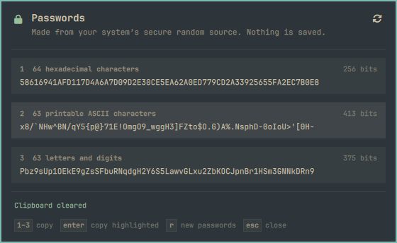

# OmaPasswords

**Strong random passwords from the Omarchy bar.**

OmaPasswords adds a padlock to your bar. Click it and you get three new random
passwords, ready to copy. They are made on your computer from the operating
system's secure random source, and they are never saved.

<p align="center">
  
</p>

## What you get

Every time the panel opens, it shows three new passwords:

| Type | Length | Strength |
| --- | --- | --- |
| Hexadecimal (0–9, A–F) | 64 characters | 256 bits |
| Printable ASCII (letters, digits and symbols) | 63 characters | 413 bits |
| Letters and digits | 63 characters | 375 bits |

Use one as it is, or take part of one. Any run of characters from these strings
is just as random as the whole, so you can copy a 20-character piece for a site
that limits length. The hexadecimal string also works as a 256-bit key, for
example a Wi-Fi password or an encryption key.

## Install

```bash
omarchy plugin add https://github.com/rclinux/omapasswords --enable
```

This copies the plugin into `~/.config/omarchy/plugins/`, checks it, and puts the
padlock on the right side of your bar. To move it:

```bash
omarchy bar move io.github.rclinux.omapasswords --section left
```

To remove it:

```bash
omarchy plugin remove io.github.rclinux.omapasswords
```

**Requirements:** Omarchy with the Quattro shell (built on Omarchy 4.0),
`wl-clipboard` (installed by default on Omarchy) and `od` from coreutils.

## Using it

Click the padlock to open the panel. Click a password to copy it, or use the
keyboard:

| Key | Action |
| --- | --- |
| `1`, `2`, `3` | Copy that password |
| `↑` `↓` (or `j` `k`) | Move the highlight |
| `Enter` | Copy the highlighted password |
| `r` | Make three new passwords |
| `Esc` | Close |

The copied row is marked, and the footer counts down until the clipboard is
cleared.

## Settings

Change a setting with `omarchy bar set`, for example:

```bash
omarchy bar set io.github.rclinux.omapasswords clearAfter 60
```

| Setting | Default | What it does |
| --- | --- | --- |
| Clear clipboard after (seconds) | 30 | Empties the clipboard this long after a copy, but only if it still holds the copied password. Set to 0 to leave the clipboard alone. |
| Show strength in bits | On | Shows each password's strength next to its name. |

## How the passwords are made

- The random bytes come from `/dev/urandom`, the kernel's cryptographically
  secure random number generator. The plugin reads 1,024 bytes with `od` each
  time it makes a new set.
- Each byte is turned into a character with rejection sampling. Bytes that would
  make some characters more likely than others are thrown away, so every
  character in a set has exactly the same chance of being picked.
- JavaScript's `Math.random()` is never used. If the random source can't be read,
  the panel shows an error and no passwords.

The logic is in [`lib/Gen.js`](lib/Gen.js), about 60 lines, and the tests in
[`test/gen.test.mjs`](test/gen.test.mjs) include a statistical check that every
character appears equally often.

## Privacy and safety

- **Nothing is stored.** Passwords exist only while the panel is open. They are
  cleared when it closes, and new ones are made the next time it opens. Nothing
  is written to disk or to a log.
- **No network access.** The plugin makes no connections.
- **Not in the process list.** A copied password is passed to `wl-copy` through
  standard input, never as a command-line argument, so other programs can't see
  it in the list of running processes.
- **Kept out of clipboard history.** The copy is marked as sensitive
  (`wl-copy --sensitive`), which tells clipboard managers that support the hint
  not to save it.
- **Cleared afterwards.** After the set time, the clipboard is emptied if it still
  holds the password. If you have copied something else in the meantime, it is
  left alone.

The plugin runs these commands and nothing else: `od` (to read
`/dev/urandom`), `wl-copy`, `wl-copy --clear` and `wl-paste`.

## Also available as a desktop app

[Prime Passwords](https://github.com/rclinux/prime-passwords) makes the same three
passwords in a standalone window, for Linux and Windows.

## Development

```bash
npm test                    # unit tests, no dependencies (Node's built-in test runner)
omarchy plugin validate .   # check the manifest
```

`omarchy plugin add` leaves a git checkout in `~/.config/omarchy/plugins/`, so you
can edit and test it there. Saved QML changes reload on their own. Changes to
`lib/*.js` need `omarchy restart shell`, because the shell caches library scripts.

## License

MIT. See [`LICENSE`](LICENSE).
